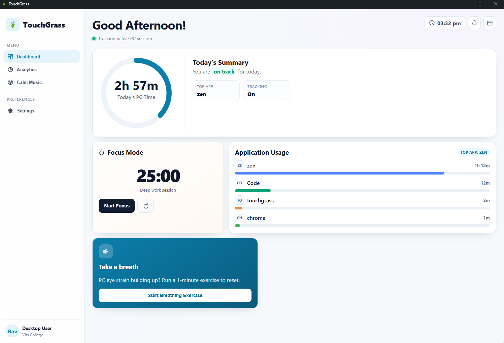

# 🌿 TouchGrass

**A lightweight, privacy-first Windows desktop app that helps you understand and improve your digital habits.**

[](LICENSE)
[](https://github.com/Pranayy1/TouchGrass/releases)
[](https://v2.tauri.app/)
[](https://www.rust-lang.org/)
[](https://github.com/Pranayy1/TouchGrass/releases)
[](https://pranayy1.github.io/touchgrass-site/)

<!-- TODO: Replace with README_assets/banner.png or README_assets/demo.gif -->
<p align="center">
  
</p>

TouchGrass is a modern, local-first Windows desktop application built with Rust and Tauri v2. It runs quietly in your system tray, tracking your screen time and per-application usage — entirely locally. No cloud. No account. No telemetry. No ads.

---

## Why TouchGrass?

Most screen-time tools require accounts, send your data to the cloud, or bundle telemetry by default. TouchGrass takes the opposite approach:

- Everything stays on your machine.
- Your data is yours.
- The app does one thing well: help you understand and improve your digital habits.

Whether you are a developer, student, or knowledge worker, TouchGrass gives you honest insight into where your time goes — without compromising your privacy.

---

## ✨ Features

### Dashboard
- Today's total screen time at a glance
- Current and top application detection
- Live tracking status indicator

### Analytics
- Per-application usage breakdown
- 7-day historical archive
- Daily rollover with automatic reset

### Focus
- Configurable focus timer (15 / 25 / 45 minutes or custom)
- Floating popup timer window
- Timer completion notification
- Pause, resume, and reset controls

### Notifications
- Persistent notification center with live sync
- Unread badge indicator
- Mark individual or all notifications as read
- Automatic cleanup of notifications older than 24 hours
- Hourly usage reminders
- 5-hour critical usage alert

### Productivity
- Breathing exercise with guided inhale/exhale phases
- Calm background music with volume control
- System tray integration with quick access
- Launch on startup support

### Privacy
- Zero network calls for tracking data
- No accounts, no logins, no telemetry
- All state stored in a single local JSON file
- Fully offline-capable

### Settings
- Toggle tracking on/off
- Toggle hourly notifications
- Toggle hide-on-close behavior
- Automatic update checker against GitHub Releases

---

## 📸 Screenshots

> Screenshots showcasing the Dashboard, Focus Timer, Notification Center, and Analytics views will be added after the next stable release.

---

## 🎥 Demo

> An animated walkthrough GIF will be added in a future release.

---

## 📥 Download

For most users, the easiest way to install TouchGrass is through the official website:

👉 **[Official Website](https://pranayy1.github.io/touchgrass-site/)**

Developers and contributors can also download the latest `.msi` installer directly from GitHub:

- [GitHub Releases](https://github.com/Pranayy1/TouchGrass/releases) — changelog and release notes
- [Marketing Repository](https://github.com/Pranayy1/touchgrass-site) — website source code

---

## 🛠 Requirements

### For Users
- Windows 10 (1903+) or Windows 11
- [Microsoft Edge WebView2 Runtime](https://developer.microsoft.com/en-us/microsoft-edge/webview2/) (pre-installed on Windows 11 and most modern Windows 10 installations)

### For Development
- [Node.js](https://nodejs.org/) 18+
- [Rust](https://www.rust-lang.org/tools/install) 1.76+
- [Tauri CLI](https://v2.tauri.app/start/prerequisites/)
- Windows SDK (for Tauri build tools)

---

## 🚀 Development Setup

```bash
# Clone the repository
git clone https://github.com/Pranayy1/TouchGrass.git
cd TouchGrass

# Install frontend dependencies
npm install

# Run in development mode
npm run tauri dev

# Build for production
npm run tauri build
```

The compiled installers will be located in `src-tauri/target/release/bundle/`. Both EXE and MSI installers are generated.

---

## 📁 Project Structure

```
TouchGrass/
├── src/                          # Frontend (vanilla JS + HTML + CSS)
│   ├── assets/                   # Static assets
│   ├── index.html                # Main window markup
│   ├── main.js                   # Main window logic
│   ├── popup.html                # Focus timer popup markup
│   ├── popup.js                  # Focus timer popup logic
│   └── styles.css                # Global stylesheet
├── src-tauri/                    # Backend (Rust + Tauri)
│   ├── src/
│   │   ├── lib.rs                # Core application logic
│   │   └── main.rs               # Tauri entry point
│   ├── Cargo.toml                # Rust dependencies
│   └── tauri.conf.json           # Tauri configuration
├── package.json                  # Node.js dependencies
└── README.md                     # This file
```

---

## 🧱 Architecture

```
┌─────────────────────────────────────────┐
│              Frontend                   │
│   Vanilla JS · HTML · CSS              │
└──────────────────┬──────────────────────┘
                   │ Tauri IPC
┌──────────────────▼──────────────────────┐
│              Rust Backend               │
│   TrackerState · Commands · Listeners   │
└──────────────────┬──────────────────────┘
                   │
        ┌──────────┼──────────┐
        ▼          ▼          ▼
  Windows APIs  Local JSON  Tauri Plugin
  (foreground   Storage     (Notification,
   window)                  Autostart)
```

The frontend communicates with the Rust backend exclusively through Tauri's `invoke` mechanism. State is persisted to a single `touchgrass_state.json` file in the platform's app data directory.

---

## 🔒 Privacy

TouchGrass is built privacy-first:

- **No account** — nothing to sign up for.
- **No login** — no credentials stored or transmitted.
- **No telemetry** — zero analytics or tracking pixels.
- **Local storage** — all data lives in a local JSON file on your machine.
- **Offline** — the app works without an internet connection. The only network call is an optional manual update check against GitHub Releases.

---

## ⚡ Tech Stack

| Layer | Technology |
|-------|------------|
| Backend | Rust |
| Framework | Tauri v2 |
| Frontend | Vanilla JavaScript |
| Styling | Vanilla CSS |
| Storage | Local JSON (`touchgrass_state.json`) |
| OS Integration | Windows APIs (Win32) |
| Notifications | Tauri Notification Plugin |
| Auto-update | GitHub Releases API |

---

## 🚧 Project Status

TouchGrass is actively maintained. New features and improvements are added regularly, and community contributions are welcome. If you encounter a bug or have a suggestion, please open an issue on GitHub.

---

## 🛣 Roadmap

### Completed
- [x] Screen time tracking
- [x] Per-application usage tracking
- [x] Daily dashboard
- [x] 7-day analytics
- [x] Focus timer with floating popup
- [x] Timer completion notifications
- [x] Persistent notification center with live sync
- [x] Unread/read tracking
- [x] Breathing exercise
- [x] Calm music
- [x] System tray support
- [x] Launch on startup
- [x] Automatic update checker
- [x] Settings page
- [x] Local JSON storage

### In Progress
- [ ] Screenshots and demo media in README

### Planned
- [ ] Linux support
- [ ] macOS support
- [ ] Notification history search
- [ ] Export usage data to CSV

---

## 🤝 Contributing

Contributions are welcome. Here is how to get started:

1. **Fork** the repository.
2. **Create a branch** for your feature or fix:
   ```bash
   git checkout -b feature/my-feature
   ```
3. **Make your changes** and ensure the project builds:
   ```bash
   cd src-tauri && cargo check
   ```
4. **Commit** with a clear message:
   ```bash
   git commit -m "feat: add notification search"
   ```
5. **Push** and open a Pull Request.

Please keep changes focused and avoid introducing unnecessary dependencies.

---

## ❓ FAQ

**Does TouchGrass send my data anywhere?**
No. All data is stored locally in `touchgrass_state.json`. The only network request is an optional manual update check.

**Does it work offline?**
Yes. Tracking, analytics, focus timer, and all core features work without an internet connection.

**Can I run it on Linux or macOS?**
Currently, TouchGrass targets Windows only. Linux and macOS support is planned.

**Where is my data stored?**
In the platform's app data directory:
- Windows: `%APPDATA%\TouchGrass\touchgrass_state.json`

**How do I reset my data?**
Delete `touchgrass_state.json` from the app data directory. The app will start fresh on next launch.

---

## 📄 License

This project is licensed under the MIT License. See the [LICENSE](LICENSE) file for details.

---

## 🔗 Links

| Resource | URL |
|----------|-----|
| Official Website | [TouchGrass](https://pranayy1.github.io/touchgrass-site/) |
| GitHub Releases | [github.com/Pranayy1/TouchGrass/releases](https://github.com/Pranayy1/TouchGrass/releases) |
| Marketing Website Repository | [github.com/Pranayy1/touchgrass-site](https://github.com/Pranayy1/touchgrass-site) |

---

## 👨‍💻 Author

**Pranay Pandey**

- GitHub: [@Pranayy1](https://github.com/Pranayy1)
- Email: pranaypandey.dev@gmail.com

---

<div align="center">

Made with 💚 using Rust, Tauri, HTML, CSS & JavaScript

⭐ If you find TouchGrass useful, consider giving the repository a star!

</div>
